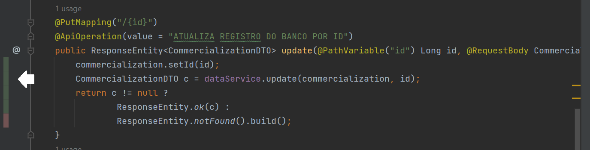

# Desafio Matriz de Dados do Crédito Rural - MDCR IBM

O projeto consiste na criação de uma rotina que efetua o processo de onboarding de uma API fonte para a base de dados local e realização das operações CRUP para cada verbo HTTP referente.

Consulte **[Implantação](#-implanta%C3%A7%C3%A3o)** para saber como implantar o projeto.

## 🚀 Começando

Para executar o projeto, será necessário instalar os seguintes programas:

[IntelliJ](https://www.jetbrains.com/pt-br/idea/) - Desenvolvimento do projeto Java

[Maven](https://maven.apache.org/) - Realizar o Build do projeto Java

[Java JDK 17](https://www.oracle.com/java/technologies/javase/jdk17-archive-downloads.html) - Execução do projeto Java.

[MySQL](https://www.mysql.com/) - Banco de dados

## 📋 Pré-requisitos

Para a execução da aplicação você precisará de uma IDE, um SGBD e uma ferramenta de Rest Client para a exibição das consultas.

## 🔧 Instalação

Etapa de explicação para instalação de componentes necessários:

### IntelliJ
1. O instalador pode ser baixado da página de download selecionando o sistema operacional e a edição necessária. 
2. Após o download, abra o instalador e siga as instruções na tela para instalá-lo. 
3. Após a instalação, um atalho será criado na área de trabalho e o menu iniciar para abrir a IDE.

### Java JDK 17
Para instalar o JDK no Linux ou no Windows primeiramente é necessário efetuar o download do arquivo de instalação. Para isso deve-se acessar o site da [Oracle](https://www.oracle.com/java/technologies/downloads/#java17) e baixar versão 17 do JDK correspondente ao sistema operacional e arquitetura (32 ou 64 bits) utilizada.

Após o download efetue a instalação, você poderá acessar o tutorial completo para instalção [neste link](https://www.devmedia.com.br/instalacao-e-configuracao-do-pacote-java-jdk/23749).

### MySQL 
Primeiramente, acesse a página de download do [instalador do MySQL](https://dev.mysql.com/downloads/installer/).

Como vamos instalar o SGBD do MySQL, vamos baixar o instalador global do Mysql, ou seja, o MySQL Installer.

* Observação: Nós escolhemos a Community, pois é a versão gratuita. 😊

Após baixar o instalador do MySQL, execute-o e siga o [tutorial completo para instalação](https://dicasdeprogramacao.com.br/como-instalar-o-mysql-no-windows/).

## ⚙️ Desenvolvimento 

1. Para iniciar o desenvolvimento, é necessário clonar o projeto do GitHub num diretório de sua preferência:
```
cd "diretorio de sua preferencia"
git clone https://github.ibm.com/Leianny-Poiani/project-MDCR.git
```

2. Para construir o projeto com o Maven, executar o comando abaixo:

```
mvn clean install
```

3. Execute a IDE, navegue pelo seu computador e selecione o projeto para visualiza-lo.

4. No MySQL, crie um novo DataBase com o nome 'project' e certifique-se de que ele esteja rodando na porta 3306.

5. Substitua no arquivo application.properties, presente na pasta resources do projeto, as configurações do banco de dados referente a usuário e senha.

```
spring.datasource.username=seuUser
spring.datasource.password=SuaSenha
```

4. Execute o programa para a criação da tabela Commercialization.

5. Popule o banco executando o endpoint POST presente no CommercializationController.

## ⌨️ Features

1. Onboarding de registros. 
2. Consulta de dados por ID.
3. Consulta de lista de recursos com paginação.
4. Consulta por parâmetros diversos.
5. Consulta específica para geração de somatório acumulado do período de doze meses para os produtos, por ano.
6. Salvar, atualizar e deletar registros da base de dados.
7. Busca por palavra chave.

## 📦 Implantação 

Para implantação utilize uma ferramenta de Rest Client, abaixo estão disponíveis algumas opções:

Arquivo Rest Client - Insomnia.json (Para importação no insomnia)

Com o projeto rodando você também utilizar o swagger através deste Link: localhost:8080/swagger-ui.html

### commercialization-controller - Controller responsável pelo onboarding.
Possui dois endpoints:
* GET - api/v1/banco-central/get - Apenas para a visualização da API.
* POST - api/v1/banco-central/save - Execução do processo de onboarding.

### data-controller - Controller responsável pelo CRUD.
Possui cinco endpoints:

* GET - api/v1/database/all  - Visualização de toda a base importada.
* GET - api/v1/database/{id}  - Consulta por ID do registro. (Passar o id na Query).
* POST - api/v1/database - Inserção de novo registro. (Passar json de registro para inserir).
* PUT - api/v1/database/{id} - Atualizar registro por ID. (Passar o id na Query).
* DELETE - api/v1/database/{id} - Deletar registro por ID. (Passar o id na Query).

### filter-controller - Controller responsável pelas operações solicitadas pela proposição da atividade.
Possui seis endpoints, todos passando verbo GET:

* GET - api/v1/filter/{id}  - Consulta por ID do registro. (Passar o id na Query).
* GET - api/v1/filter/  - Consulta da lista com paginação. (Opcional informar page e size).
* GET - api/v1/filter/consult3 - Consulta com parametros diversos. (Opcional informar os parâmetros, caso contrário retorna toda a base).
* GET - api/v1/filter/year - Consulta de valor acumulado por produto por ano (Passe o ano a ser pesquisado).
* GET - api/v1/filter/keyword - Busca por palavra chave no banco (Passar por query ou param).

## 🔩 Testes 

### Testes unitários

Os testes contidos na aplicação executam as funcionalidades das Classes de controller e services analisando cada método individualmente.

### Cobertura

Para verificar a cobertura dos testes você deve clicar com o botão direito sobre o pacote principal da aplicação de testes e executar a opção "Run 'Tests in 'projeto.dados.credito.rural.mdcr' with Coverage.

Você pode também verificar quais linhas de código estão sendo cobertas pelos testes ao observar na classe.



Onde há barrinhas verdes o código está sendo testado, onde a barra está vermelha, não há testes sendo executados.

### Executando os testes

Para executar os testes individualmente basta abrir o pacote de testes e executar o testes que estará presente com um simbolo :white_check_mark: ao lado de cada método.

Você poderá executar, Debug ou ainda Run With Coverage.

Para executar todos os testes presentes em uma classe siga os mesmos passos e execute a própria classe da mesma maneira que foi mencionada acima.


## 🛠️ Construído com

* [Springboot](https://spring.io/projects/spring-boot) - Framework web 
* [Maven](https://maven.apache.org/) - Gerente de Dependência
* [MySQL](https://www.mysql.com/) - Banco de dados
* [Java JDK 17](https://www.oracle.com/java/technologies/javase/jdk17-archive-downloads.html) - Linguagem de programação
* [IntelliJ](https://www.jetbrains.com/pt-br/idea/) - IDEA
* [Insomnia](https://docs.insomnia.rest) - Rest Client
* [Git](https://git-scm.com/) - Versionamento
* [GitHub](https://github.com/) - Repositório remoto
## ✒️ Autoria

* **Leianny Poiani** - [Leianny-Poiani](https://github.ibm.com/Leianny-Poiani)
## 🎁 Expressões de gratidão

* Agradecimento aos instrutores Marcos Padilha e Jessica Senna que contribuiram para o avanço do projeto e para o aprendizado da autora. 😊

---
⌨️ com ❤️ por [Leianny Poiani](https://github.ibm.com/Leianny-Poiani) 
